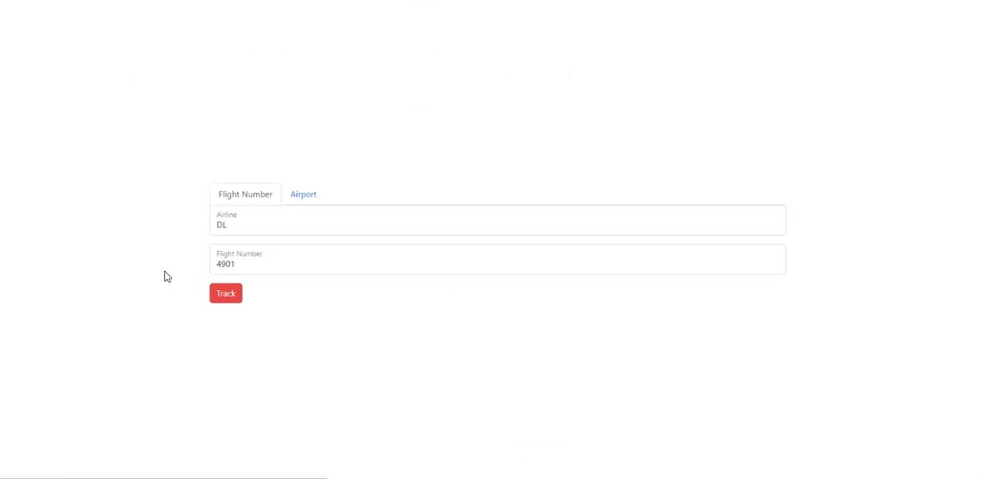
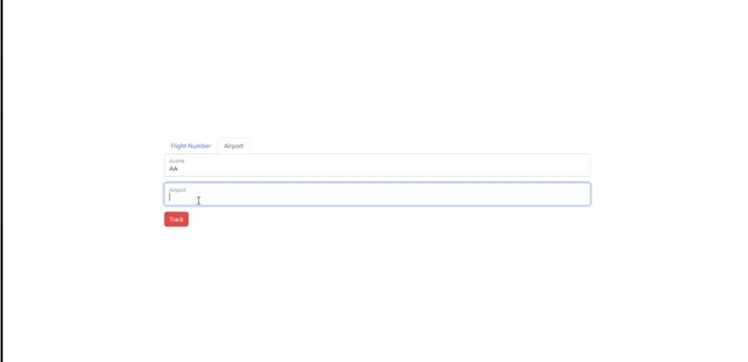
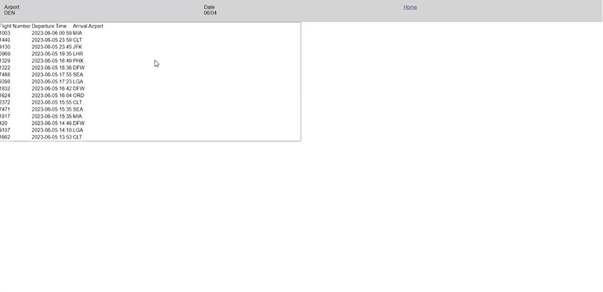
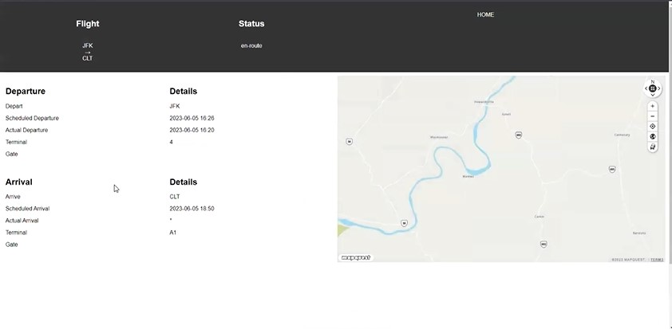

# Flight Tracker 

## Description 
The motivation for this project was learning how to work with a team in order to accomplish our goal to create a application where users could look up a flight based off certain criteria and the results would display the flight status information. Our team built this project because we wanted to apply our in class learnings to a real life situation. The problems our team solved connecting two server side API's to our website in order to make dynamic data display. What our team learned was how to delegate tasks and then be able to work there merge conflicts.

## Screenshots

## GitHub URL
https://github.com/sjhudek/project-1.git

## Live Website URL
https://sjhudek.github.io/project-1/

## API's Used
https://airlabs.co/
https://developer.mapquest.com/

## Installation 
Clone the repository https://github.com/sjhudek/project-1.git or zip it to your local repository 

## User Story
As a traveler, I want to be able to easily look up the status of a flight on the flight tracker website, so that I can stay informed about its departure and arrival times.

## Acceptance Story
GIVEN a flight tracker website with a form to input

WHEN I search for a flight with the airline and flight number, or WHEN I search for the airport and airline

THEN I the user is taken to the list of flights where the site displays the airport, date, and time of day, and a list of flights with arrival and departure time, and a map

WHEN the list of flight options display the user can choose from the list based off the criteria the user entered on the homepage 

THEN the user clicks on a flight

WHEN the user is taken to the flight details

THEN the user is shown that specific flight information such as: Flight #, Route, Status of if the flight has landed, the date/time the flight details were updated, departure details (date, scheduled departure, actual departure, terminal, and gate), arrival details ( airport arriving at, arrival date, scheduled arrival, estimated arrival, terminal, and gate) and last the user can see a map of where the flight departed and landed.

WHEN a user wants to visit the Homepage to reset their search they are able to access the HOME navigation button on the top of each of the flight list and flight details landing pages

## Authors
Steve Hudek,
Kara Faris,
Mark Podrabinnik

